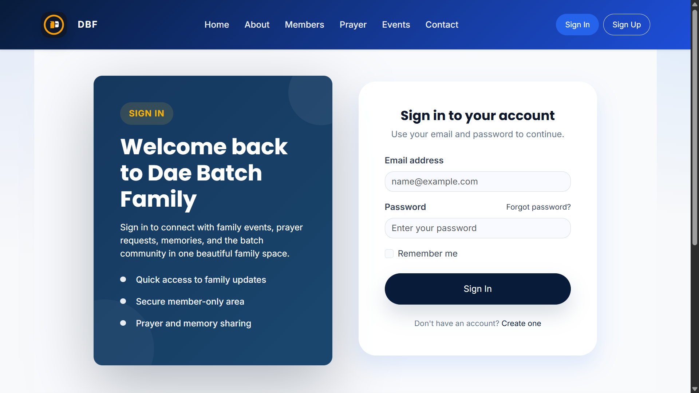
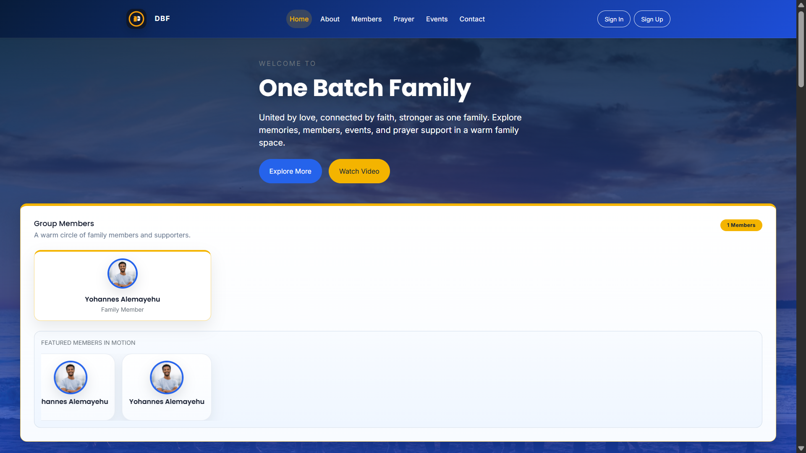
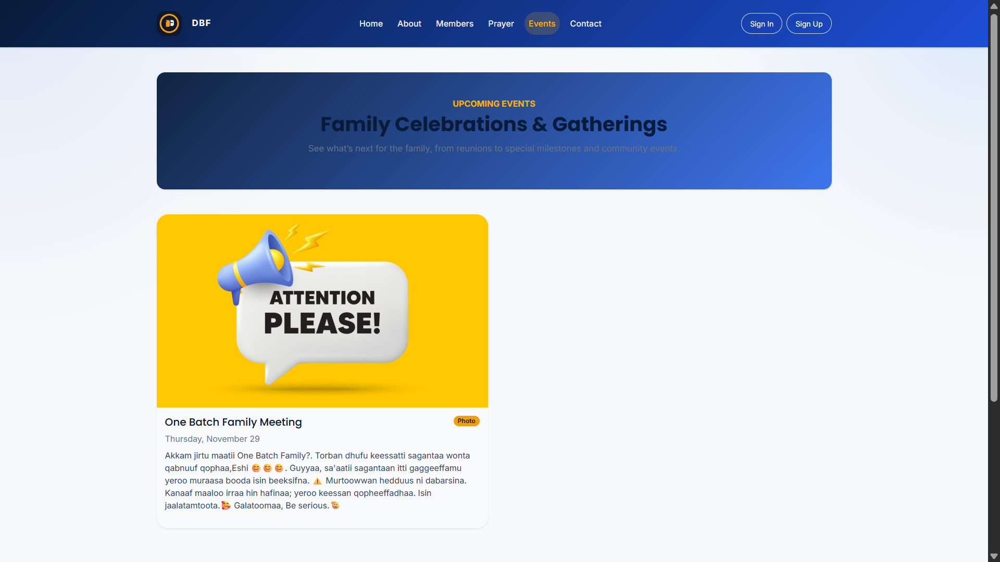
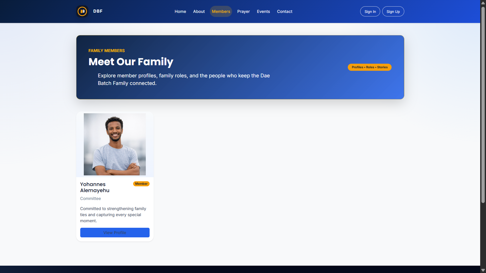
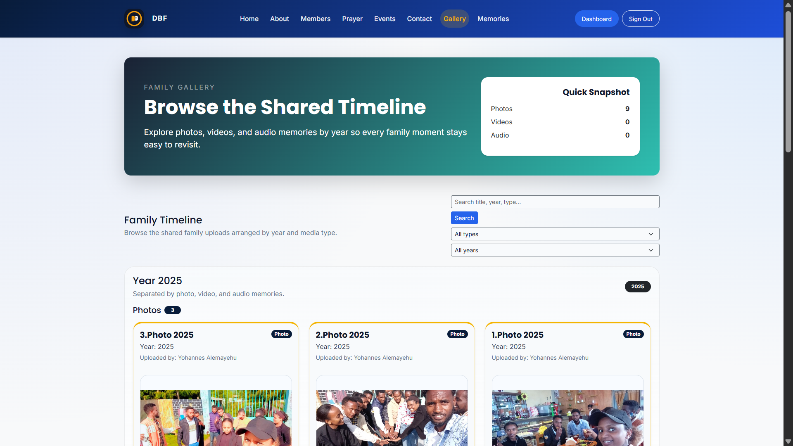
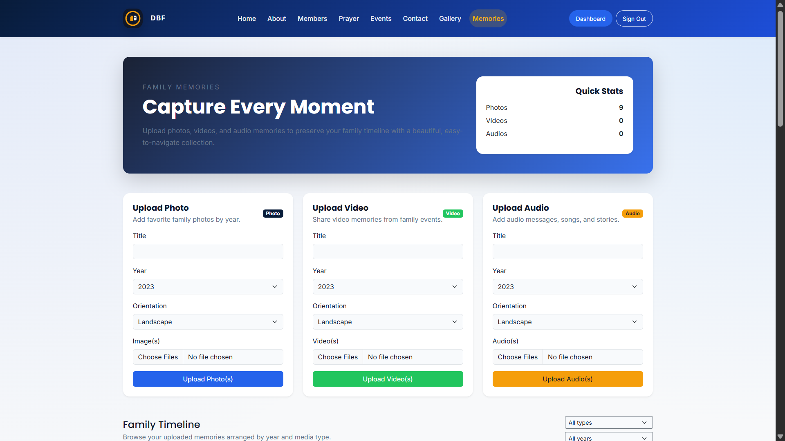
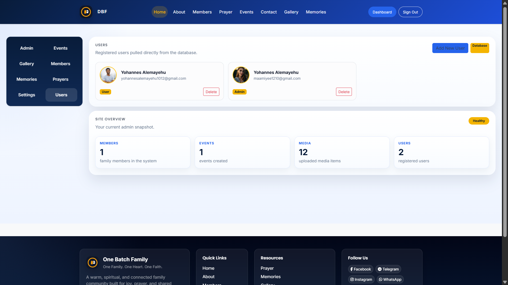
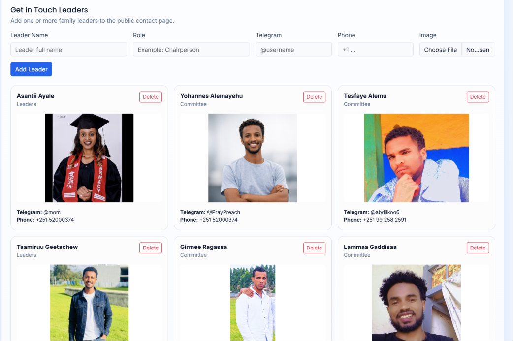
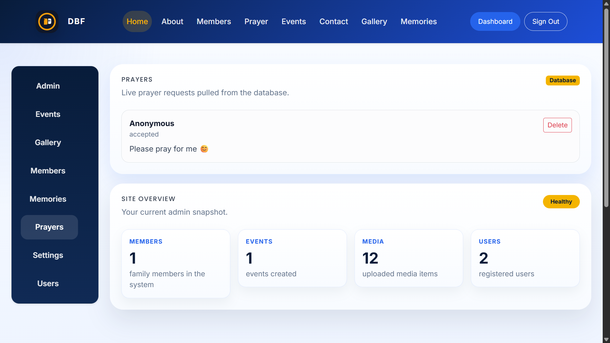
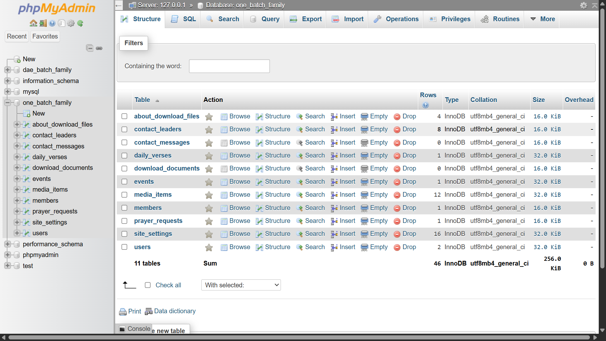

# 👨‍👩‍👧‍👦 One Batch Family Website

A modern, full-featured PHP + MySQL family website built with HTML5, CSS3, Bootstrap 5, and JavaScript. Perfect for families to share memories, connect, and stay updated.


## 🌟 Features

- **User Authentication** - Secure member login and registration
- **Memory Sharing** - Year-based memory organization
- **Family Dashboard** - Personalized user dashboard
- **Admin Panel** - Complete administration interface
- **Responsive Design** - Mobile-first Bootstrap 5 framework
- **Modern UI/UX** - SweetAlert2, AOS animations, and Swiper carousels
- **Data Visualization** - Chart.js for family statistics
- **AJAX Support** - Smooth, real-time interactions
- **SEO Ready** - Semantic HTML5 structure

## 📁 Project Structure

```
one-batch-family/
├── index.php                 # Home page
├── config/                   # Database & app configuration
├── assets/                   # CSS, JS, images, media
├── includes/                 # Shared components (header, footer, navbar)
├── pages/                    # Site pages
├── auth/                     # Authentication pages
├── user/                     # User dashboard & profile
├── admin/                    # Admin panel & management
├── api/                      # JSON endpoints & AJAX handlers
├── models/                   # Data models
├── helpers/                  # Utility functions
├── database/                 # SQL schemas & seeds
└── .htaccess                 # Apache configuration
```

## 🛠️ Technologies

| Technology | Purpose |
|-----------|---------|
| **PHP 8+** | Backend server logic |
| **MySQL** | Database management |
| **HTML5** | Semantic markup |
| **CSS3** | Styling |
| **Bootstrap 5** | Responsive framework |
| **JavaScript** | Client-side interactions |
| **AJAX** | Asynchronous requests |
| **SweetAlert2** | Beautiful alerts & dialogs |
| **Chart.js** | Data visualization |
| **Swiper JS** | Responsive carousels |
| **AOS** | Scroll animations |
| **Lightbox.js** | Image gallery |
| **Google Fonts** | Typography |
| **Bootstrap Icons** | Icon library |

## 📋 Requirements

- **PHP** 8.0 or higher
- **MySQL** 5.7 or higher
- **Apache** with `mod_rewrite` enabled
- **Composer** (optional, for dependency management)
- **XAMPP/LAMP/LEMP** stack recommended

## 🚀 Installation

1. **Clone the repository**
   ```bash
   git clone https://github.com/yohannesalemayehu1012/one-batch-family.git
   ```

2. **Configure the database**
   - Copy `config/database-sample.php` to `config/database.php`
   - Update database credentials
   ```php
   define('DB_HOST', 'localhost');
   define('DB_USER', 'root');
   define('DB_PASS', '');
   define('DB_NAME', 'one_batch_family');
   ```

3. **Import the database schema**
   ```bash
   mysql -u root < database/schema.sql
   ```

4. **Set directory permissions**
   ```bash
   chmod -R 755 assets/uploads
   ```

5. **Access the application**
   - Open `http://localhost/one-batch-family` in your browser

## 📖 Usage

### Member Registration
- Navigate to the signup page
- Complete the registration form
- Verify email (if enabled)
- Login with credentials

### Share Memories
- Go to the memories section
- Add memories organized by year
- Upload photos and descriptions
- Tag family members

### Admin Dashboard
- Login as administrator
- Manage members and content
- View family statistics
- Configure settings

### Screenshots

### login


### Home


### Events


### Members


### Gallery 


### Memories 


### Users


### Settings 


### Prayers 


### database.png



## 🔒 Security Features

- Password hashing with bcrypt
- CSRF protection tokens
- SQL injection prevention (prepared statements)
- XSS attack mitigation
- Secure session management
- Input validation & sanitization

## 📊 Database Schema

Key tables:
- `users` - User accounts and profiles
- `memories` - Family memories and events
- `photos` - Photo uploads and galleries
- `events` - Family events
- `comments` - Memory comments
- `admins` - Administrator accounts

## 🤝 Contributing

Contributions are welcome! Please follow these steps:

1. Fork the repository
2. Create a feature branch (`git checkout -b feature/AmazingFeature`)
3. Commit changes (`git commit -m 'Add AmazingFeature'`)
4. Push to branch (`git push origin feature/AmazingFeature`)
5. Open a Pull Request

## 📝 License

This project is open source and available under the MIT License.

## 💬 Support

For support, email [support@onebatchfamily.com](mailto:support@onebatchfamily.com) or open an issue on GitHub.

## 🙏 Acknowledgments

- Bootstrap team for the amazing framework
- All open-source libraries and contributors
- The family community for inspiration

---

**Built with ❤️ for families by Yohannes Alemayehu**

*Last Updated: September 2026*
